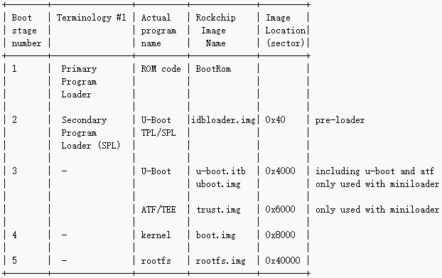
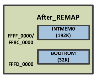
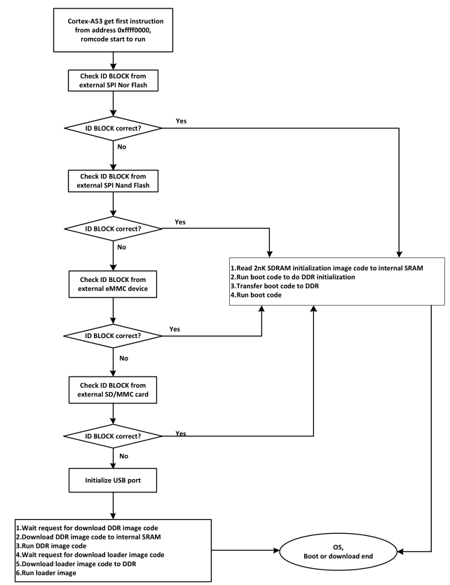
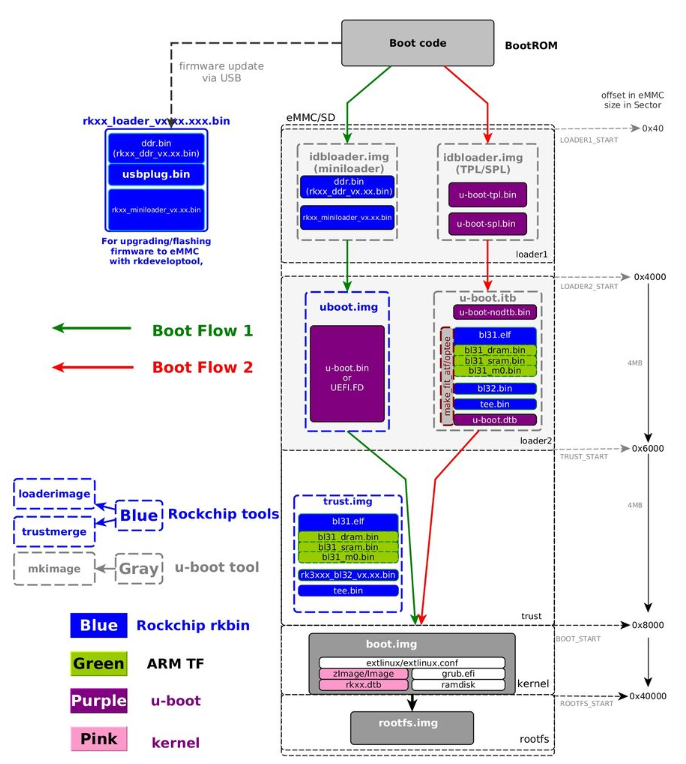
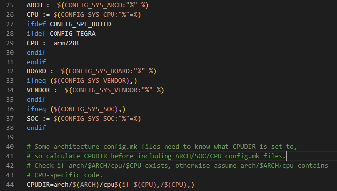
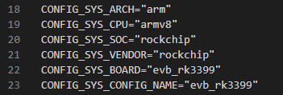

# RK3399 Bootloader的启动过程

&emsp;&emsp;RK3399启动流程可分为以下几个阶段：

<center></center>

!!! 注意
    对于不同的片上系统SOC而言，BootLoader细节各不相同，但总体上还是遵循上述几个阶段。

详情请查看瑞芯微的Boot flow说明：http://opensource.rock-chips.com/wiki_Boot_option

&emsp;&emsp;系统启动时，首先执行BootRom中的代码，即ROM代码。然后，ROM代码将加载第2阶段引导程序，即SPL。无论是ROM代码还是SPL，都需要在内存中执行，即ROM代码和SPL都需要先载入SoC的内部SRAM中，才能由CPU执行。

&emsp;&emsp;一般来说，SoC中的内部SRAM并不足以载入完整的整个引导加载程序。因此，RK3399在每次复位或启动时，都预先加载辅助程序加载器（含ROM代码、SPL），并由SPL初始化容量更大的DDR，以便在DDR中执行后续的引导程序，提高引导效率。

## 第1阶段：只读存储器代码

&emsp;&emsp;ROM代码在芯片制造时就会被写入芯片中，因为ROM代码是芯片专有的且不能被任何开源设备替代。SRAM也是片上系统内置的RAM，SRAM的大小从4KB到几百KB不等。RK3399芯片内置有32KB ROM和192KB SRAM，如下图所示。

<center></center>

&emsp;&emsp;BootRom代码在SRAM上运行，校验存储设备里的BootLoader。对于RK3399芯片，在SPL中会依次查找存储控制器：SPI nor Flash、SPI nand Flash、eMMC、SD/MMC，如果在这些存储器的起始处都找不到idbloader.img（miniloader，Rockchip瑞芯微格式的预加载器），则初始化USB端口，等待从USB端口下载ddr.bin、usbplug.bin、miniloader等镜像；假设能在SD/MMC中能找到idbloader.img，并校验通过，则初始化主存DDR，并将SD/MMC中的boot启动代码拷贝到DDR，加载BootLoader完整代码到DDR内存中并运行。详细见如下流程图。



&emsp;&emsp;在本课程的实验中，将从SD卡启动，即固件的启动顺序如下：



## 第2阶段：预引导加载程序（IDBLoader）

&emsp;&emsp;idbloader.img是Rockchip格式的预加载器，是由Rockchip发布的（暂无开源代码），假设它可以在SoC启动时工作，它包含：

> Rockchip BootRom已知的IDBlock标头；
>
> 由BootRom加载并在内部SRAM上运行的DRAM初始化程序；
>
> 下一阶段的加载程序U-boot，由BootRom加载并在DDR SDRAM上运行。

## 第3阶段：U-boot

&emsp;&emsp;现在，将运行一个完整的引导加载程序：U-Boot（Universal Boot Loader）。

&emsp;&emsp;U-Boot启动大多都分为两个阶段：

### (1) U-Boot启动的第1阶段

&emsp;&emsp;第1阶段的主要任务是对依赖于CPU体系结构的相关硬件进行初始化，该阶段通常使用汇编语言实现。

&emsp;&emsp;第1阶段的具体任务包含以下5部分：

&emsp;&emsp;1) 基本的硬件设备初始化（屏蔽所有的中断、关闭CPU内部的ICache/DCache等）;

&emsp;&emsp;2) 为第2阶段准备RAM空间;

&emsp;&emsp;3) 如果是从某个固态存储媒质中启动，则复制Bootloader的第2阶段代码到RAM;

&emsp;&emsp;4) 设置堆栈;

&emsp;&emsp;5) 跳转到第2阶段的C程序入口。

&emsp;&emsp;这里主要涉及2个汇编文件来完成最底层的初始化：start.S和crt0_64.S。

```assembly
1. start.S
路径：arch/arm/cpu/armv8/start.S

```

&emsp;&emsp;怎么得到这个路径arch/arm/cpu/armv8？
​

&emsp;&emsp;首先进到u-boot根目录找到config.mk，该文件中有如下声明：



&emsp;&emsp;CONFIG_SYS_ARCH 和 CONFIG_SYS_CPU这些宏在哪里定义的呢？也在u-boot的根目录下有一个叫.config的文件，里面定义了很多宏：

<center></center>

&emsp;&emsp;我们在编译U-Boot的时候，需要输入make gw3399_defconfig用于写入gw3399的默认配置，该配置文件在configs/gw3399_defconfig，make gw3399_defconfig则将gw3399_defconfig的配置导入.config文件中。

```
2. crt0_64.S
路径：arch/arm/lib/crt0_64.S
crt0是C Runtime Startup的简称，这部分程序主要完成C语言环境的初始化，最终会运行_main函数。
```

### (2) U-Boot启动的第2阶段

&emsp;&emsp;第2阶段通常使用C语言实现，以实现更复杂的功能，也使程序有更好的可读性和可移植性。

第2阶段的具体任务有：

&emsp;&emsp;1) 初始化本阶段要使用到的硬件设备;

&emsp;&emsp;2) 检测系统内存映射;

&emsp;&emsp;3) 将内核映像和根文件系统映像从Flash读到RAM;

&emsp;&emsp;4) 为内核设置启动参数;

&emsp;&emsp;5) 调用内核。

&emsp;&emsp;这一部分的初始化主要由以下两个C文件实现：

```
common/board_f.c
common/board_r.c
```

## 固件启动顺序

&emsp;&emsp;BootRom -> Loader -> U-Boot -> Trust -> Kernel -> rootfs
