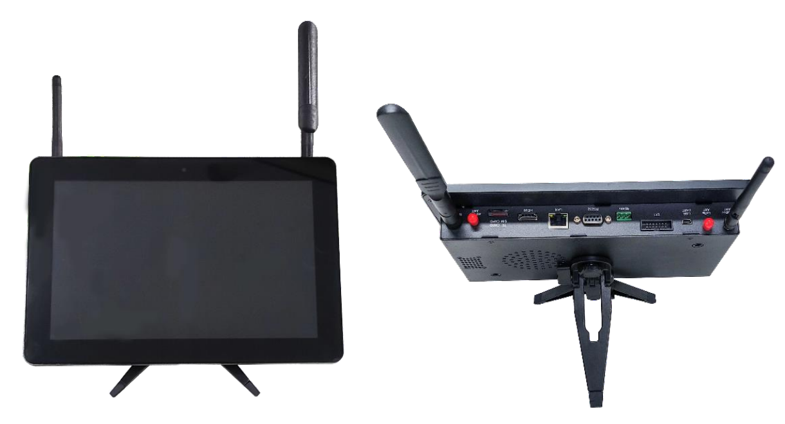
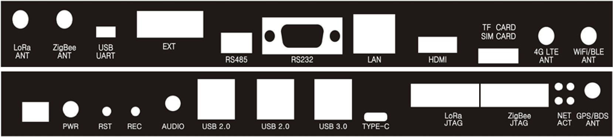
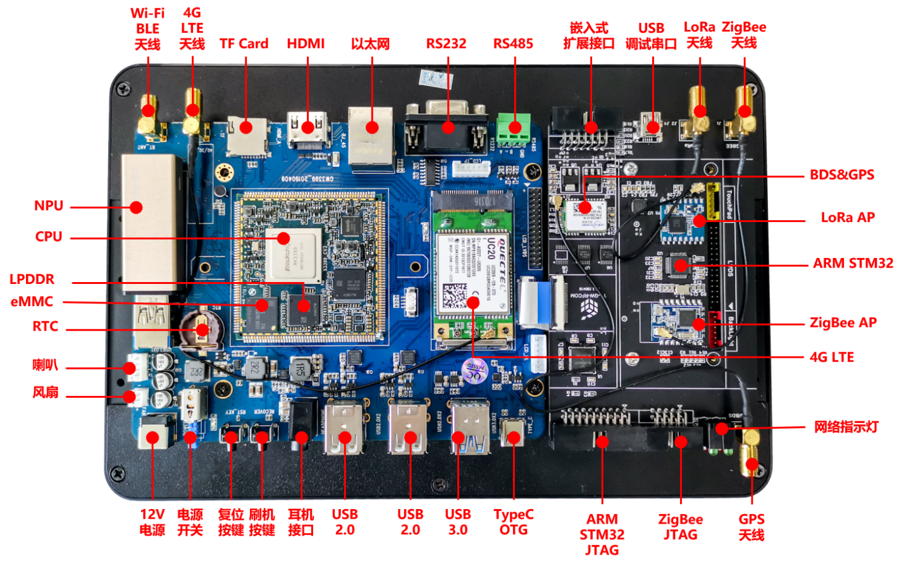
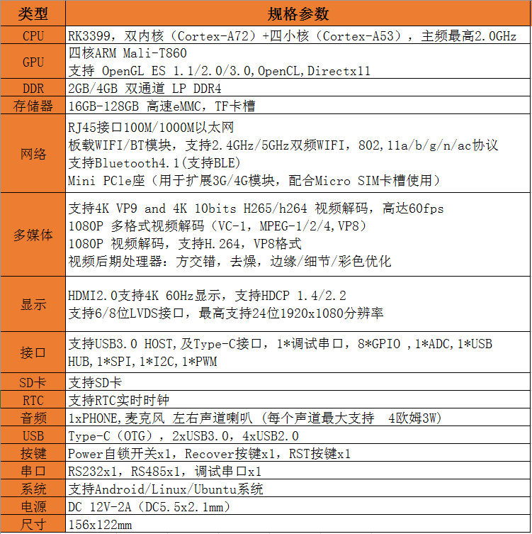
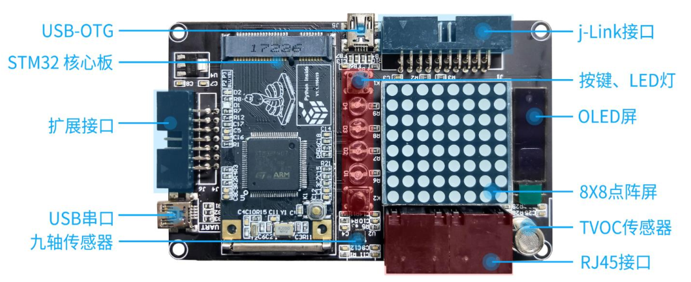
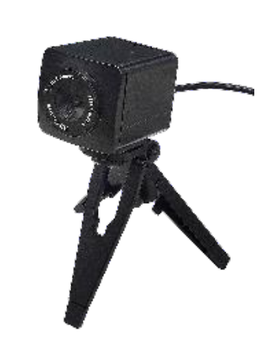
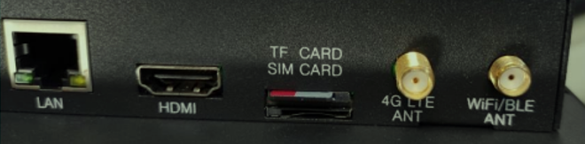
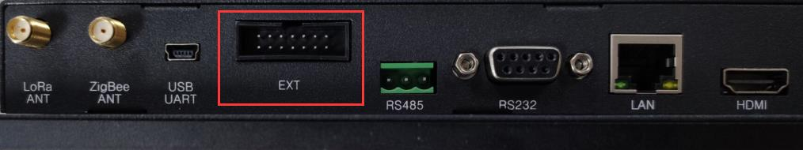
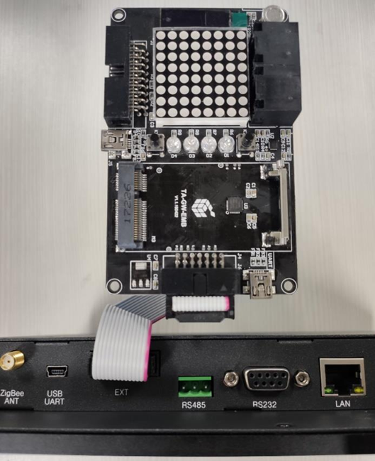

# 嵌入式平台简介

------

嵌入式实验教学平台主要由嵌入式计算网关GW3399、ARM扩展板和基础配件包组成。嵌入式网关采用瑞芯微公司推出的一款低功耗、高性能的嵌入式计算处理器RK3399，该芯片是一颗64位六核处理器，双核Cortex-A72和四核Cortex-A53小核心，最高主频可达2.0GHz。此外，在嵌入式计算网关GW3399中还集成了Linux、Python、机器学习、深度学习等运行环境，满足人工智能视觉、语言、机器控制等算法、硬件、应用的开发和学习。ARM扩展板采用ARM Cortex-M7低功耗处理器，提供8*8点阵、OLED、按键、九轴传感器等扩展模块。基础配件包提供有摄像头、天线、电源、连接线等。

## 1.  嵌入式计算网关GW3399

嵌入式计算网关GW3399特性：

- RK3399处理器，ARM 64位大小核架构，Cortex-A72和Cotex-A53多核处理器，四核Mali-T860 GPU，4GB LPDDR4，16GB EMMC。  
- 10.1寸1280*800 LVDS高清屏，10点触控电容屏，工业级铝合金一体屏外壳。
- 2.4G & 5G双频Wi-Fi模组，BLE4.1模组，全网通LTE通信模组，GPS & BDS双频定位模组，ZigBee & LoRa传感网AP模组。  
- 1000M LAN，HDMI、Type-C OTG，USB 3.0 Host，USB 2.0 Host*2，USB Debug UART，RS232，RS485，TF Card，MIC，喇叭，24PIN嵌入式拓展接口。  

嵌入式网关的正面和反面：

嵌入式计算网关GW3399提供丰富的外设接口，易于功能扩展，方便开发调试。嵌入式计算网关的上下部接口示意见下图：

嵌入式计算网关GW3399内部框架：

嵌入式计算网关GW3399规格参数：

## 2.  ARM扩展板

ARM扩展板采用STM32F407处理器，集成有24PIN嵌入式接口板，集成GPIO/PWM双驱动LED4，按键2，IIC接口陀螺仪 & 加速度 & 地磁仪，I2C接口OLED，ADC接口TVOC，8*8矩阵LED，步进电机等外设模块。

STM32F407 MCU 提供了工作频率为 168 MHz 的 Cortex™-M4 内核（具有浮点单元）的性能。在 168 MHz 频率下，从 Flash 存储器执行时，STM32F407 单片机能够提供 210 DMIPS/566 CoreMark 性能，并且利用意法半导体的 ART 加速器实现了 FLASH 零等待状态。

ARM扩展板硬件框图如下：

## 3.  基础配件

基础配件提供有摄像头、天线、电源、连接线等。摄像头特性如下：

- 1080P 工业级 AI 宽动态摄像头，125 度广角镜头焦距，支持自动聚焦。
- 提供远程网络视频远程传输功能，AI 视觉图像视频捕捉处理功能。

摄像头:  

# 硬件连接操作

------

## 1.  TF卡的插取

!!! 说明
    TF卡正确插入是能感受到一定弹性的，否则很可能插反！

## 2.  ARM扩展板的连接

将ARM扩展模块与嵌入式网关连接。如下图所示，框线内为GW3399的ARM扩展模块接口。

连接完成的示意图如下：

