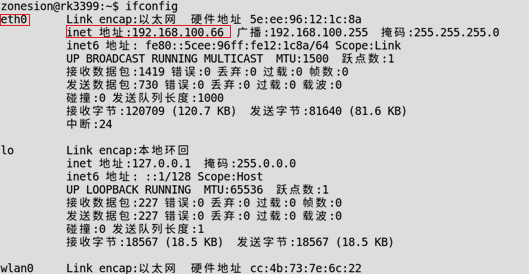
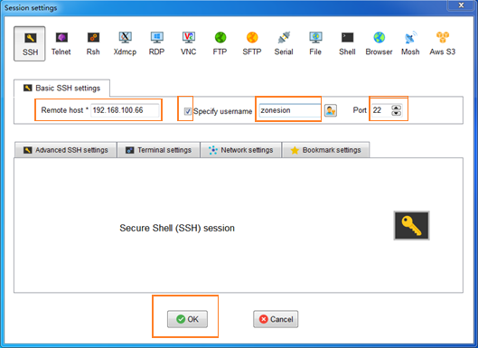
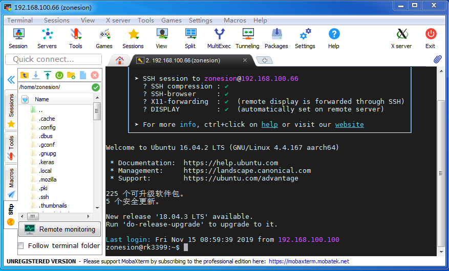
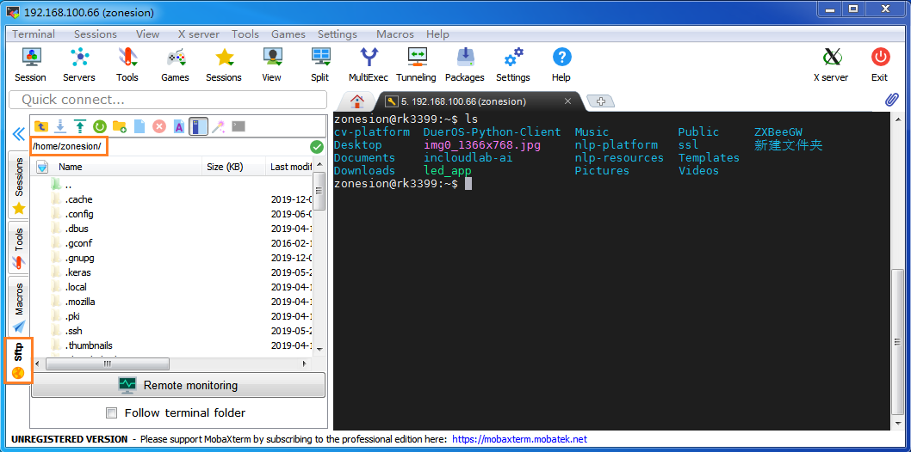
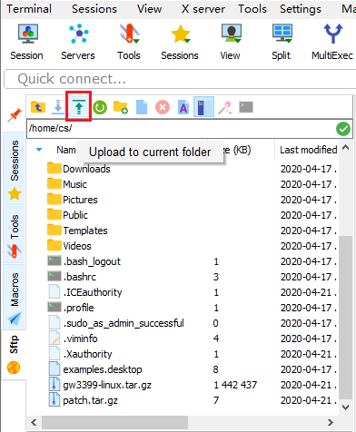
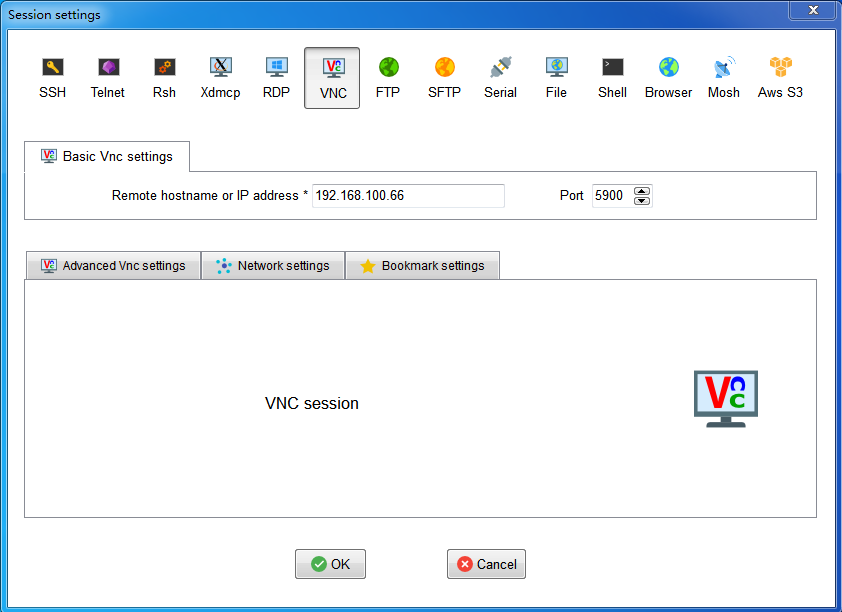
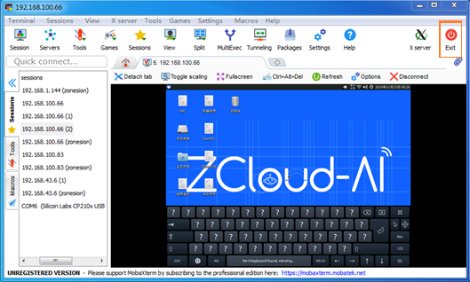

# 嵌入式平台远程登录

------

目前网络上出现有很多种远程登录工具，在嵌入式计算实验中，推荐同学们使用MobaXterm。

MobaXterm 是一款远程控制工具，支持创建SSH、Telnet、Rsh、Xdmc、RDP、VNC、FTP、 SFTP、串口(Serial COM)、本地Shell、Mosh、Aws、WSL(微软子系统)等超多连接功能。MobaXterm 提供了人性化的操作界面，支持与主流的操作系统连接进行控制和管理操作，功能十分强大。

在实验中，常用到的MobaXterm功能有SSH，SFTP，Serial，VNC等。

## 1.  SSH远程登录

SSH为Secure Shell的缩写，由IETF的网络小组（Network Working Group）所制定；SSH 为建立在应用层基础上的安全协议。SSH是目前较可靠，专为远程登录会话和其他网络服务提供安全性的协议。利用 SSH 协议可以有效防止远程管理过程中的信息泄露问题。

远程登录可以通过无线和有线两种方式进行（**如果使用无线连接，需要接上Wifi天线**）。远程登录的关键点有两个，第一个是GW3399开发板和PC处于同一个网段且两者能ping通，第二个是GW3399开发板必须开启SSH服务，可以用一下命令查看sshd是否已经被正确的运行了：

    # ps -waux | grep sshd

GW3399默认已经开启了SSH，所以只需要让PC和开发板于同一网段且能ping通即可，这里PC的IP地址是192.168.100.88。

在开发板终端输入ifconfig命令，可以GW3399的IP地址信息如下：（有线连接网卡是eth0，无线连接网卡是wlan0）

可以看到eth0对应的inet地址是192.168.100.66，不同的GW3399平台是不一样的，要使用自己开发板对应的inet地址。如果eth0对应的inet地址不存在，可以使用以下命令创建

    # sudo ifconfig eth0 192.168.100.66

这里192.168.100.66仅供参考，也可设置成其他的，比如192.168.100.37。

打开MobaXterm，单击打开工具Session（位于左上角）选择New sessions打开新建窗口，选择SSH，输入开发板IP地址、登陆用户名及端口（默认22），点击OK。

SSH配置信息如下：

!!! 注意

​	用户名是“zonesion”，密码是“123456”，输入密码即可实现远程登录。

SSH 登录成功界面：

## 2.  文件传输SFTP服务

SSH远程登录完毕，在左下角没有一个竖着的Sftp，双击它，就出现了开发板的文件目录，当前路径是home/zonesion

接下来在可以点击下图红色框框的按钮“Upload to current folder”,选择你要传输的文件，传输到GW3399开发板的当前目录下home/zonesion。

## 3.  VNC远程登录

SSH登录后显示的是终端界面，VNC还可以实现远程桌面登录。VNC (Virtual Network Console)是虚拟网络控制台的缩写。

首先开发板要和Windows处于同一个网段，要能够ping通，参考SSH远程登录。单击打开工具“Session”，然后选择“VNC”，输入GW3399的IP地址，端口号选择5900，点击OK如下图所示。

VNC配置信息：

若弹出输入选项密码选项，输入密码123456即可，若弹出选择框，就选择yes，即可实现远程登录。

VNC登录成功界面：

若要退出，选择右上角红色的Exit。