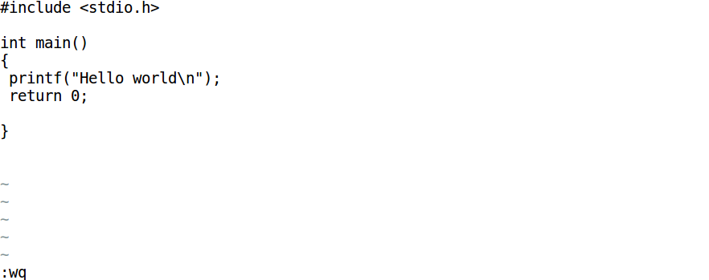

# 常用的LINUX命令

## 1.  基本命令

```bash
ls：显示当前目录下的所有文件和目录。
ls -a：可以看到隐藏的文件，如以.开头的文件。
pwd：显示当前目录路径。
ps：列举当前TTY 下所有进程
ps -A：列举所有
cd 目录名：进入目录
mkdir 目录名：创建目录
rmdir 目录名：删除空目录
rm -rf 目录名：强行删除整个目录内容（无法恢复），其中f 表示强制不进行提示，r 表示目录递归。
```

注：LINUX 下的文件和目录是区分大小写的。

## 2.  压缩/解压缩

LINUX 的软件一般是以.gz 或.tar 或者.tar.gz 结尾的。前者是由gzip压缩的，后者是先用tar 归档，在用gzip 压缩而成的。

```bash
以.gz 结尾的为压缩文件，用命令：gzip -d filename 来解压，得到的文件在当前目录中，但已没有了.gz。
以.tar 结尾的为归档文件，用命令：tar -xvf filename 来展开，生成的文件与源文件在同一目录中，只是少了.tar。
以.tar.gz 结尾的文件最常见，可直接用命令：gzip -cd filename| tar xfv 来解开。
```


## 3.  VI简介

vi 是Linux/Unix 世界里极为普遍的可视化的全屏幕文本编辑器(visual edit)，几乎可以说任何一台Linux/Unix 机器都会提供这个软件。

vi 有三种状态，即编辑方式、插入方式和命令方式。在命令方式下，所有命令都要以：开始，所键入的字符系统均作命令来处理，如:q 代表退出，:w 表示存盘。当你进入vi 时，会首先进入命令方式（同时也是编辑方式）。按下i 就进入插入方式，用户输入的可视字符都添加到文件中，显示在屏幕上。按下ESC 就可以回到命令状态（同时也是编辑方式）。

编辑方式和命令方式类似，都是要输入命令，但它的命令不要以:开始，它直接接受键盘输入的单字符或组合字符命令，例如直接按下u 就表示取消上一次对文件的修改，相当于WINDOWS 下的Undo操作。编译方式下有一些命令是要以/开始的，例如查找字符串就是：/string 则在文件中匹配查找string 字符串。在编辑模式下按下:就进入命令方式。

基本操作如下：

```bash
$ vi hell0.c
```

然后按下键盘的字母 i 键（无所谓大小写），显示为插入模式，然后就可以进行文本的编辑了。

编写完毕，按“Esc”键，则当前模式转入命令行模式，并在底行行中输入“: wq”保存退出进入底行模式，如下图所示。这样，就完成了一个简单的vi操作流程。

