# 系统固件更新

------

固件文件一般有两种：

| 固件文件类型 | 说明                                                         |
| ------------ | ------------------------------------------------------------ |
| 统一固件     | update.img, 将启动加载器、参数和所有分区镜像都打包到一起，用于固件发布。 |
| 分立固件     | 如uboot.img, trust.img, boot.img 等，在开发阶段生成。        |

一般情况下，建议通过Windows主机，为GW3399更新系统固件。主机操作系统支持：Windows XP/7/8/10（32/64位），Linux（32/64位）。

系统固件更新有三种方法：

1. 制作SD卡启动盘
2. Windows环境下更新SD卡固件
3. Linux环境下更新SD卡固件

第一种方法需要使用SD卡读卡器，将SD卡插到电脑中，对SD卡进行烧写。后两种方法只需要将SD卡插到RK3399开发板中，通过Type-C连接线连接电脑，即可以在windows/linux环境下更新固件。


## 1.  制作SD卡启动盘

首先，将SD卡插入读卡器，连接到PC。

打开实验包的Tools文件夹，运行SDDiskTool\_v1.56中的SD\_Firmware\_Tool.exe，选中SD卡后，点击“选择固件”按钮，选择Ubuntu文件夹的update-MiniLinux.img：

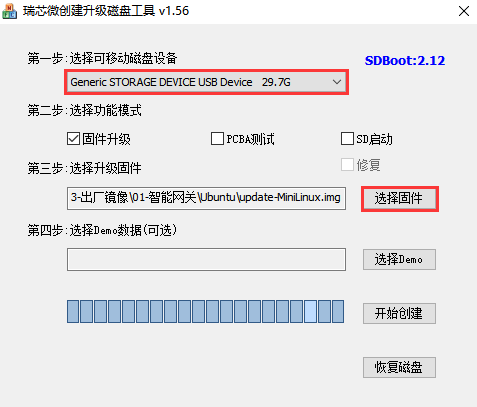

选择“固件升级”，点击“开始创建”：

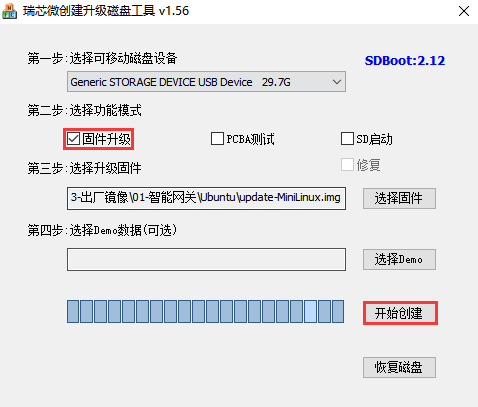

如下图所示，提示“写入MBR失败”，这是正常的，点击确定继续下一步：

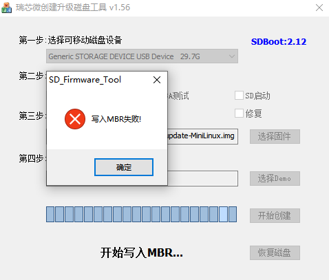

选择“SD启动”，再次点击“开始创建”：

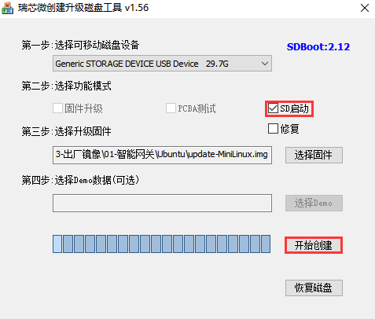

如下图所示，提示“创建升级磁盘成功”，说明SD卡启动盘制作成功：

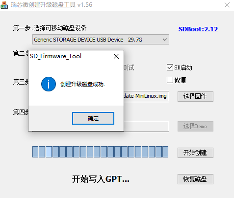

SD卡启动盘制作完成后即可插入RK3399开发板中使用。

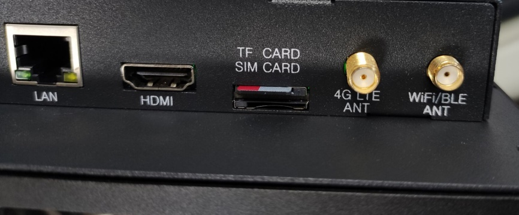


## 2.  Windows环境下更新固件

### 2.1  安装RK USB驱动

打开实验包中的Tools文件夹，找到DriverAssitant\_v4.5，然后运行里面的DriverInstall.exe。为了所有设备都使用更新的驱动，请先选择“驱动卸载”，然后再选择“驱动安装”。

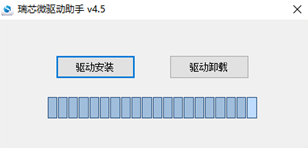

### 2.2  连接设备

首先，将SD卡启动盘插入GW3399，然后，按照以下步骤可以使设备进入升级模式：

1. 关闭电源开关（PWR）
2. Type-C数据线一端连接主机，一端连接GW3399
3. 按住设备上的REC键并保持
4. 打开电源开关（PWR）
5. 大约三秒钟后，松开REC键  

主机会提示发现新硬件并配置驱动。打开设备管理器，会见到新设备“Rockusb Device” 出现，如下图。如果没有，则需要返回上一步重新安装驱动。

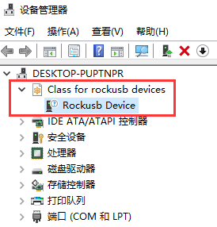

### 2.3  更新系统

打开实验包的Tools文件夹，选择AndroidTool\_Release，然后运行里面的AndroidTool.exe。

更新方式有两种，可以烧写统一固件，也可以只烧写部分分区映像。

- 烧写统一固件update.img

烧写统一固件的步骤如下：

1. 切换至“升级固件”页
2. 按“固件”按钮，打开要升级的固件文件。升级工具会显示详细的固件信息
3. 按“升级”按钮开始升级

升级完成后，提示信息如下图，系统自动重启。


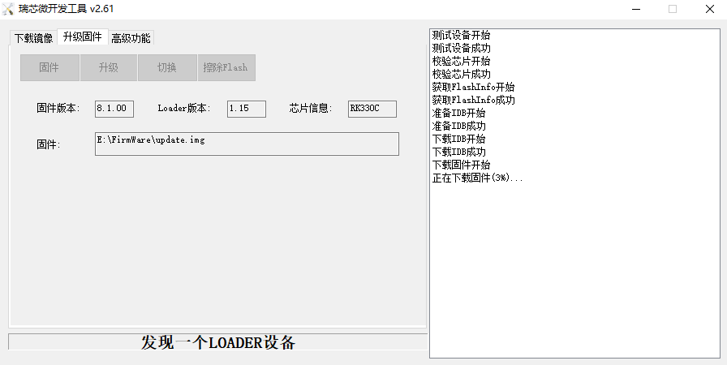

> 注意：插SD卡时，一定不能点击“擦除Flash”按钮！否则会出一系列错误，并且要重新按“制作SD卡启动盘”步骤制作SD卡启动盘。

- 烧写分区映像

烧写分区映像的步骤如下：

1. 切换至“下载镜像”页
2. 勾选需要烧录的分区，可以多选
3. 确保映像文件的路径正确，需要的话，点路径右边的空白表格单元格来重新选择
4. 点击“执行”按钮开始升级，升级结束后设备会自动重启

> 注意：要更新rootfs时，必须同时更新parameter，否则有可能出现文件系统挂载不上、无法启动的问题。

第一次烧写分区映像到SD卡时，建议烧写全部6个分区映像。

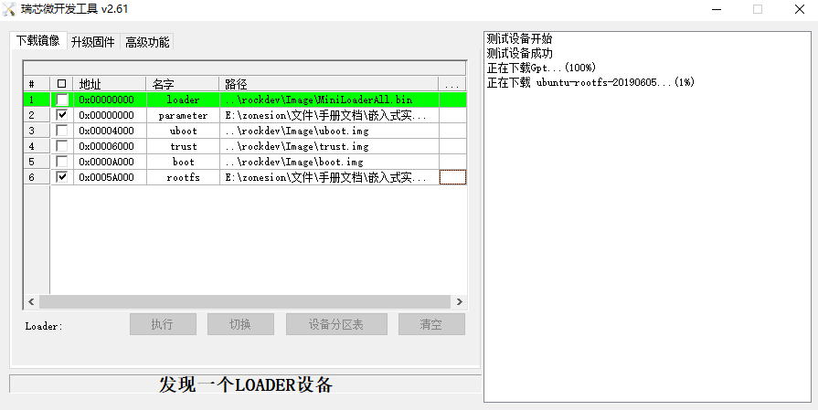


## 3.  Linux环境下更新固件

一般情况下，建议使用Windows主机，为GW3399更新系统固件。这里仅对Linux下更新固件的方法做简单的说明。

Linux 下无须安装设备驱动。按照以下操作让设备进入Loader模式，再按下图将Rockchip USB分配到虚拟机

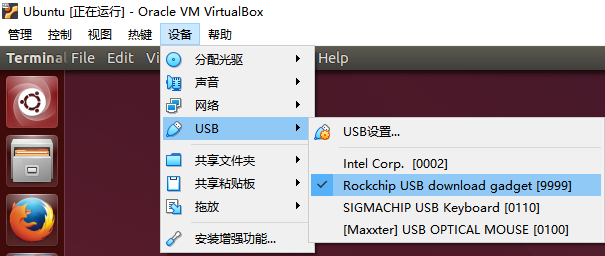


接着重新让设备进入Loader模式：

1. 关闭电源开关（PWR）
2. Type-C数据线一端连接主机，一端连接GW3399
3. 按住设备上的REC键并保持
4. 打开电源开关（PWR）
5. 大约三秒钟后，松开REC键  

在Tools下，找到Linux\_Upgrade\_Tool.tar.gz，复制到Linux虚拟机中，然后再Linux虚拟机中解压：

```bash
$ mkdir ~/mysdk
$ sudo tar -xvzf Linux_Upgrade_Tool.tar.gz ~/mysdk #解压刷机工具
```

### 3.1  烧写统一固件update.img

将统一固件复制到Linux虚拟机中，然后通过以下指令，开始升级固件。等待一段时间后，刷机完成，设备自动重启。

```bash
$ sudo ./upgrade_tool uf ../update.img #烧写统一固件
```

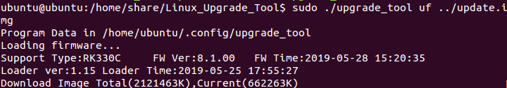

如果升级失败，可以尝试先擦除后再升级。

```bash
# 擦除flash 使用ef参数需要指定loader文件或者对应的update.img
$ sudo ./upgrade_tool ef ../update.img #update.img :你需要烧写的ubuntu固件
# 重新烧写
$ sudo ./upgrade_tool uf ../update.img	
```

### 3.2  烧写分立固件：Ubuntu(GPT)

将要烧写的分区镜像复制到\textasciitilde/mysdk/下，然后选择下列指令中的一条或几条，烧写分立固件：

```bash
$ sudo ./upgrade_tool ul ../MiniLoaderAll.bin  #烧写Loader
$ sudo ./upgrade_tool di -p ../parameter.txt  #烧写parameter
$ sudo ./upgrade_tool di -uboot ../uboot.img  #烧写U-Boot
$ sudo ./upgrade_tool di -trust ../trust.img  #烧写trust
$ sudo ./upgrade_tool di -b ../boot.img   #烧写Linux内核
$ sudo ./upgrade_tool di -rootfs ../rootfs.img #烧写Ubuntu文件系统  
```

如果因 flash 问题导致升级时出错，可以尝试低级格式化、擦除 nand flash：

```bash
$ sudo upgrade_tool lf update.img  #低级格式化
$ sudo upgrade_tool ef update.img  #擦除
```

