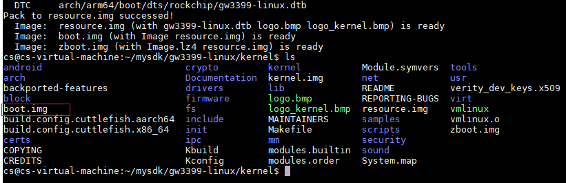

# 实验步骤

## 1. 导入虚拟机

&emsp;&emsp;本实验提供已安装好实验环境的Ubuntu20.04虚拟机。实验开始前，需要在VirtualBox中导入虚拟机镜像。

&emsp;&emsp;首先，下载并安装VirtualBox及VirtualBox的扩展包，安装完成后打开VirtualBox。

&emsp;&emsp;然后，按照如下图所示，依次点击相应的按钮以导入虚拟机。

<center></center>

&emsp;&emsp;点击“打开”按钮后，检查下图所示的设置是否与物理机兼容。如果出现不兼容，需根据物理机的配置进行相应的修改。

<center></center>

&emsp;&emsp;检查无误后，点击窗口右下方的“导入”按钮，耐心等待虚拟机导入完成。

## 2.  获取系统sdk

&emsp;&emsp;首先，在Ubuntu系统中/home/embsys目录下，新建文件夹mysdk，然后在实验包里的gw3399-linux目录下，复制gw3399-linux.tar.gz（包含uboot、kernel）和patch.tar.gz到/home/embsys/mysdk目录下。

&emsp;&emsp;接下来，通过tar指令解压sdk包：

```bash
$ cd ~/mysdk
$ sudo tar -xvf gw3399-linux.tar.gz
```

&emsp;&emsp;等待解压完成后，通过ls命令，可看到mysdk目录下多了一个gw3399-linux目录。

&emsp;&emsp;接着，给sdk打上patch.tar.gz的补丁包：

```bash
$ cp patch.tar.gz gw3399-linux 	# 复制补丁包到Linux SDK根目录下
$ cd gw3399-linux				# 切换到Linux SDK根目录
$ sudo tar -xvf patch.tar.gz 	# 解压补丁包，覆盖之前的源码
$ sudo rm patch.tar.gz			# 删除补丁包
```


## 3.  编译U-Boot

&emsp;&emsp;首先，设置交叉编译器环境变量：

```bash
$ cd ~/mysdk/gw3399-linux/
$ export PATH=$PATH:~/mysdk/gw3399-linux/prebuilts/gcc/linux-x86/aarch64/gcc-linaro-6.3.1-2017.05-x86_64_aarch64-linux-gnu/bin
```

&emsp;&emsp;注意，上述设置仅对当前打开的终端有效。如果不想每次打开终端都输一遍上述命令，可将交叉编译器的路径添加到系统的环境变量中。

&emsp;&emsp;然后，输入以下命令以配置编译U-Boot：

```bash
$ cd ./u-boot
$ make gw3399_defconfig # 写入默认配置
$ make CROSS_COMPILE=aarch64-linux-gnu- # 开始编译  
```


&emsp;&emsp;等待一段时间后，编译完成，生成u-boot.img：


&emsp;&emsp;但这个u-boot.img并不能直接使用，还需要通过以下指令，打包生成rk兼容的u-boot文件：

```bash
$ ../rkbin/tools/loaderimage --pack --uboot u-boot.bin uboot.img 0x00200000 
```


&emsp;&emsp;这样生成的uboot.img（注意：u和boot中间没有横杠-），才是可以更新到GW3399中的U-Boot固件。

&emsp;&emsp;接下来，通过以下指令，打包生成*\_loader\_*.bin和trust.img：

```bash
$ cd ../rkbin
$ ./tools/boot_merger --replace tools/rk_tools/ ./ ./RKBOOT/RK3399MINIALL.ini  
$ sudo mv *_loader_*.bin ../u-boot/ #将生成的bin文件移动到u-boot目录
$ tools/trust_merger --replace tools/rk_tools/ ./ RKTRUST/RK3399TRUST.ini	#生成trust.img
$ sudo mv trust.img ../u-boot/	#将生成的trust.img移动到u-boot目录
```


&emsp;&emsp;最后，将这三个有效镜像文件复制到输出目录（output目录），然后清理过程文件：

```bash
$ cd ../u-boot/
$ sudo cp -v ./*_loader_*.bin ../output/MiniLoaderAll.bin
$ sudo cp -v ./uboot.img ../output/
$ sudo cp -v ./trust.img ../output/
$ make clean  
```

&emsp;&emsp;综上所述，通过编译U-Boot，将三个可以烧写到GW3399的分区映像（uboot.img，trust.img，MiniLoaderAll.bin）输出到了output目录：

```bash
$ cd ../output/
$ ls
```

<center></center>


## 4.  编译Linux内核

&emsp;&emsp;编译Linux内核的方法和编译U-Boot类似，并且过程更为简捷。

&emsp;&emsp;首先，设置交叉编译器环境变量：

```bash
$ cd ~/mysdk/gw3399-linux/
$ export PATH=$PATH:~/mysdk/gw3399-linux/prebuilts/gcc/linux-x86/aarch64/gcc-linaro-6.3.1-2017.05-x86_64_aarch64-linux-gnu/bin
```

&emsp;&emsp;然后，配置编译Linux内核：

```bash
$ cd ./kernel/
$ make ARCH=arm64 gw3399_linux_defconfig  #写入默认配置
$ make ARCH=arm64 CROSS_COMPILE=aarch64-linux-gnu- #开始编译
#编译内核设备树并生成boot.img
$ make ARCH=arm64 gw3399-linux.img CROSS_COMPILE=aarch64-linux-gnu-
```

&emsp;&emsp;等待一段时间后，编译完成，生成boot.img：



&emsp;&emsp;最后，将这个boot.img复制到输出目录（output目录），然后清理过程文件：

```bash
$ sudo cp -v ./boot.img ../output/
$ make clean
```

&emsp;&emsp;综上所述，通过编译Linux内核，将一个可以烧写到GW3399的分区映像（boot.img）输出到了output目录：

<center></center>


## 5.  Ubuntu文件系统制作

&emsp;&emsp;本节讲解从官网下载纯净版Ubuntu核心，在ARM64 AARCH64上构建最小的Ubuntu文件系统的方法。本节只是讲述文件系统的制作方法，制作出的文件系统是不带桌面的，只能通过串口访问。带桌面的文件系统（出厂镜像）制作方法与本节完全相同，只是需要安装桌面、各种软件包，生成的文件系统较大。

&emsp;&emsp;首先，在~/mysdk目录下，新建rootfs目录。从实验包的rootfs文件夹中，将ch-mount.sh和ubuntu-base-16.04.2-base-arm64.tar.gz（官方Ubuntu核心）复制到rootfs目录下。复制方法可参照MobaXterm 远程登录工具MobaXterm 中的文件传输SFTP服务。

&emsp;&emsp;在rootfs目录中创建新目录ubuntu-rootfs，将压缩包通过tar指令解压到这个目录下。等待一段时间，解压完成后，可以通过ls命令，看到ubuntu-rootfs目录下的文件结构已经完成：

```bash
$ cd ~/mysdk
$ mkdir rootfs
$ cd ./rootfs/
$ sudo mkdir ubuntu-rootfs
$ sudo tar -xvf ubuntu-base-16.04.2-base-arm64.tar.gz -C ubuntu-rootfs
$ cd ./ubuntu-rootfs/
$ ls
```


&emsp;&emsp;接着，使用qemu在X86环境下构建出arm虚拟机，可以模拟arm环境进行开发，在arm linux的文件系统中安装相应的库文件，编译arm版本等。

&emsp;&emsp;通过以下指令，安装qemu-user-static，搭建arm64模拟环境：

```bash
$ sudo apt-get install qemu-user-static
$ sudo cp /usr/bin/qemu-aarch64-static ./usr/bin
$ sudo cp -b /etc/resolv.conf etc/
```

&emsp;&emsp;通过ch-mount.sh脚本，chroot到arm64的文件系统下：

```bash
$ cd ../
$ chmod +x ch-mount.sh
$ sudo ./ch-mount.sh -m ubuntu-rootfs/
```

&emsp;&emsp;如图，命令行提示符前缀变成了root@ubuntu，说明chroot成功：

<center></center>

&emsp;&emsp;安装基础软件包（这一步需要网络，如果没有网络可以跳过）

&emsp;&emsp;在更新软件过程中，如果国外源太慢了，可以修改为中科大源，修改如下：

```bash
$ cd /etc/apt
$ echo "deb http://mirrors.ustc.edu.cn/ubuntu-ports/ xenial main multiverse restricted universe
deb http://mirrors.ustc.edu.cn/ubuntu-ports/ xenial-backports main multiverse restricted universe
deb http://mirrors.ustc.edu.cn/ubuntu-ports/ xenial-proposed main multiverse restricted universe
deb http://mirrors.ustc.edu.cn/ubuntu-ports/ xenial-security main multiverse restricted universe
deb http://mirrors.ustc.edu.cn/ubuntu-ports/ xenial-updates main multiverse restricted universe
deb-src http://mirrors.ustc.edu.cn/ubuntu-ports/ xenial main multiverse restricted universe
deb-src http://mirrors.ustc.edu.cn/ubuntu-ports/ xenial-backports main multiverse restricted universe
deb-src http://mirrors.ustc.edu.cn/ubuntu-ports/ xenial-proposed main multiverse restricted universe
deb-src http://mirrors.ustc.edu.cn/ubuntu-ports/ xenial-security main multiverse restricted universe
deb-src http://mirrors.ustc.edu.cn/ubuntu-ports/ xenial-updates main multiverse restricted universe
" > sources.list
```

```bash
$ apt-get update   #更新软件列表
$ apt-get install language-pack-en-base sudo net-tools ethtool wireless-tools network-manager iputils-ping rsyslog bash-completion
```

&emsp;&emsp;这一步中安装了基础语言包、sudo命令包、网络工具包、tab键命令补全工具等最常用的基础软件包。带桌面的文件系统（出厂镜像）制作要在这一步安装桌面和大量附加软件包，其余步骤完全相同。

&emsp;&emsp;接下来，设置用户名与密码、root密码和主机名：

```bash
$ useradd -s '/bin/bash' -m -G adm,sudo zonesion  #添加用户zonesion
$ passwd zonesion  #设置zonesion用户密码
123456  #输入密码
123456   #确认密码
$ passwd root      #设置root密码
123456  #输入密码
123456   #确认密码
$ echo 'GW3399' > /etc/hostname  #设置主机名
```

&emsp;&emsp;设置完成后，退出arm64模拟文件系统：

```bash
$ exit         #注销当前用户
$ sudo ./ch-mount.sh -u ubuntu-rootfs/    #卸除当前挂载的文件系统
```

<center></center>

&emsp;&emsp;然后，创建作为rootfs固件容器的img文件（注意：格式化时需要输入y回车）：

```bash
$ sudo dd if=/dev/zero of=ubuntu-rootfs.img bs=1M count=1024        #制作空的固件容器
$ sudo mkfs.ext4  ubuntu-rootfs.img       #将img文件格式化为ext4格式
```

 

&emsp;&emsp;接着，将arm64文件系统内容制作到ubuntu-rootfs.img：

```bash
$ sudo mkdir ubuntu-mount                         	#新建挂载目录
$ sudo mount ubuntu-rootfs.img ubuntu-mount/     	#将img文件挂载到挂载目录
$ sudo cp -rfp ubuntu-rootfs/* ubuntu-mount/      	#将设置好的文件系统复制到挂载目录
$ sudo umount ubuntu-mount/               			#将img文件从挂载目录卸除
$ sudo e2fsck -p -f ubuntu-rootfs.img     			#检查文件系统是否正常
$ sudo resize2fs -M ubuntu-rootfs.img     			#将rootfs压缩到符合其占用空间的大小
```

&emsp;&emsp;最后，将制作完成的ubuntu-rootfs.img复制到输出目录（output目录），然后清理过程文件：

```bash
$ sudo cp -v ./ubuntu-rootfs.img ../gw3399-linux/output/rootfs.img
$ cd ../
$ sudo rm -rf rootfs/
```

&emsp;&emsp;综上所述，通过上述操作，将可以烧写到GW3399的Ubuntu文件系统（rootfs.img）输出到了output目录：

```bash
$ cd ./gw3399-linux/output/
$ ls
```

<center></center>


## 6.  系统固件打包

&emsp;&emsp;由于出厂镜像的文件系统过于庞大，本节仍通过上一节生成的最小Ubuntu文件系统，来演示系统固件打包方法。

&emsp;&emsp;首先，在Windows主机的D盘（或其他有足够空间的磁盘）根目录下，新建FirmWare文件夹，然后在FirmWare文件夹下新建Image文件夹。

&emsp;&emsp;接着，将之前生成的5个固件，从Linux虚拟机的output目录中复制到Image文件夹。复制方法可使用远程登录工具MobaXterm 中的文件传输SFTP服务，或通过共享文件夹拷贝。

&emsp;&emsp;打开Image文件夹，新建parameter.txt，将以下内容复制到parameter.txt中并保存：

```bash
FIRMWARE_VER: 8.1
MACHINE_MODEL: RK3399
MACHINE_ID: 007
MANUFACTURER: RK3399
MAGIC: 0x5041524B
ATAG: 0x00200800
MACHINE: 3399
CHECK_MASK: 0x80
PWR_HLD: 0,0,A,0,1
TYPE: GPT
CMDLINE: mtdparts=rk29xxnand:0x00002000@0x00004000(uboot),0x00002000@0x00006000(trust),0x00002000@0x00008000(misc),0x00010000@0x0000a000(boot),0x00010000@0x0001a000(recovery),0x00010000@0x0002a000(backup),0x00020000@0x0003a000(oem),0x00700000@0x0005a000(rootfs),-@0x0075a000(userdata:grow)
uuid:rootfs=614e0000-0000-4b53-8000-1d28000054a9
```

!!! 注意
    从CMDLINE开始一直到uuid之前都是同一条命令，不要分行！

&emsp;&emsp;在实验包的固件打包工具，将RKImageMaker.exe、AFPTool.exe和package-file（package-file可根据实际情况修改）复制到FirmWare文件夹，然后按下Win+R打开运行窗口，输入cmd打开命令行窗口：

<center></center>

&emsp;&emsp;在命令行窗口中，通过以下指令切换到FirmWare文件夹：

```bash
> D:
> cd FirmWare
```

<center></center>

&emsp;&emsp;通过以下指令，先通过AFPTools将几个固件打包成一个单独的update.img，然后通过RKImageMaker.exe将update.img制作成可用于RK3399的固件（注：第2行和第3行是一条指令）：

```bash
> Afptool -pack ./ Image\update.img
> RKImageMaker.exe -RK330C Image\MiniLoaderAll.bin  Image\update.img update.img -os_type:androidos
```


&emsp;&emsp;最后，在FirmWare文件夹中的update.img即为打包完成的系统固件

!!! 说明
    本节生成的统一固件是不带桌面的，可以在实验包的ubuntu文件夹中，将ubuntu-rootfs-20190609.img和parameter.txt烧写到GW3399，从而获得带桌面的Ubuntu系统。

&emsp;&emsp;参照Windows环境下更新固件来烧录update.img。


## 7. 启动新固件

&emsp;&emsp;启动新固件之前，先通过Mini-USB线，将GW3399的UART串口连接到PC：


&emsp;&emsp;然后，打开MobaXterm，点击Session -> Serial，选择GW3399对应的端口号，如果不知道GW3399对应的是哪个端口，打开设备管理器即可查看（GW3399必须上电）：

<center></center>

&emsp;&emsp;选择端口后，将端口连接属性设置为下图所示（波特率：115200，数据流控制：无）。


&emsp;&emsp;串口连接成功后，按GW3399的RESET键复位，等待GW3399重启：

&emsp;&emsp;最后，输入用户名与密码（用户名：zonesion，密码：123456），登录到GW3399：

<center></center>

&emsp;&emsp;至此，新固件启动成功。
