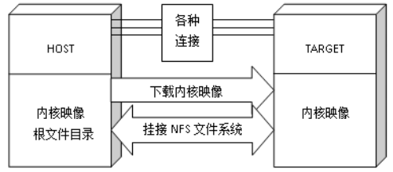

# 实验原理

## 1. 交叉编译

&emsp;&emsp;在同学们以前学习的课程中，源程序的编写、编译和运行都在同一个平台完成，而本课程涉及嵌入式开发，需要使用交叉编译技术。

&emsp;&emsp;交叉编译是嵌入式开发中的一项重要技术。所谓“交叉”，是指在一个平台上生成另一个平台的可执行代码，并且这两个平台采用不同的ISA（比如一个是X86，另一个是ARM），如下图所示。

<center></center>

&emsp;&emsp;一方面，交叉编译给嵌入式开发提供了可能性。部分嵌入式系统受限于应用场景，需要裸机运行程序。此时，只能通过交叉编译来开发嵌入式程序。另一方面，交叉编译提高了嵌入式开发的效率。虽然部分嵌入式系统可以运行OS（如嵌入式Linux、VxWorks等），也能安装诸如GCC的编译器，从而可以直接在嵌入式平台上进行开发。但由于嵌入式系统受限于资源、功耗等限制条件，其性能与PC相比较差，开发效率较低。此时，可在PC平台上安装交叉编译器，从而可以将嵌入式程序的开发过程挪到PC端，以提高开发效率，缩短产品的研发周期。

&emsp;&emsp;要进行交叉编译，需要先在Host平台上安装相应的交叉编译工具链，然后用工具链编译源代码，最终生成可在目标平台上运行的二进制可执行文件。

&emsp;&emsp;为了方便开发和调试，交叉编译工具链一般整合了编辑、编译、汇编、链接、调试、工程管理及函数库等常用功能模块。

## 2. GW3399固件

&emsp;&emsp;固件有两种格式：

​&emsp;&emsp;（1）统一固件

&emsp;&emsp;统一固件是通过官方烧写工具，将所有分区的镜像打包成独立的一个文件，方便系统进行升级。

​&emsp;&emsp;（2）分立固件

&emsp;&emsp;分立固件是分区的映像数据。例如，编译Ubuntu SDK会构建出uboot.img、trust.img、boot.img等分区映像文件。通过官方的烧写工具可以对具体的单一分区固件进行选择性升级。

&emsp;&emsp;本实验使用的GW3399平台采用分立固件，主要包含BootLoader、Trust、U-Boot、Boot、RootFS等分区映像以及包含固件分区信息的parameter文本文件。

### 2.1 parameter.txt

&emsp;&emsp;parameter.txt包含了固件的版本号、分区类型、分区地址、分区大小等关键信息。

&emsp;&emsp;下面以parameter-ubuntu.txt为例子做介绍：

```txt
FIRMWARE_VER: 8.1
MACHINE_MODEL: RK3399
MACHINE_ID: 007
MANUFACTURER: RK3399
MAGIC: 0x5041524B
ATAG: 0x00200800
MACHINE: 3399
CHECK_MASK: 0x80
PWR_HLD: 0,0,A,0,1
TYPE: GPT
CMDLINE:mtdparts=rk29xxnand:0x00002000@0x00004000(uboot),0x00002000@0x00006000(trust),0x00002000@0x00008000(misc),0x00010000@0x0000a000(boot),0x00010000@0x0001a000(recovery),0x00010000@0x0002a000(backup),0x00020000@0x0003a000(oem),-@0x0005a000(rootfs:grow)
uuid:rootfs=614e0000-0000-4b53-8000-1d28000054a9
```

!!! 注意
    CMDLINE只有一行！写到parameter.txt时注意不要分行。

&emsp;&emsp;其中，CMDLINE给出了分区信息。以uboot为例，0x00002000@0x00004000(uboot)中，0x00004000为uboot分区的起始位置，0x00002000为分区的大小，即：分区大小@分区起始位置，后面的分区规则相同。用户可以根据自己需要增减或者修改分区信息，但是请最少保留uboot, trust, boot, rootfs分区，这是机器能正常启动的前提条件。

### 2.2 分区说明

&emsp;&emsp;GW3399固件中，必须包含U-Boot、Trust、Boot、RootFS分区，其余可根据需要进行配置。

| 分区          | 说明                                                         |
| ------------- | ------------------------------------------------------------ |
| uboot 分区    | 烧写 uboot 编译出来的 uboot.img                              |
| trust 分区    | 烧写 uboot 编译出来的 trust.img                              |
| misc 分区     | 烧写 misc.img。开机检测进入recovery模式.（可选）           |
| boot 分区     | 烧写 kernel 编译出来的 boot.img，包含kernel和设备树信息      |
| recovery 分区 | 烧写 recovery.img.（可选）                                 |
| backup 分区   | 预留,暂时没有用。后续可作为recovery的backup使用.（可选）   |
| oem 分区      | 给厂家使用,存放厂家的 app 或数据，只读。挂载在/oem 目录.（可选） |
| rootfs 分区   | 存放buildroot或者debian编出来的rootfs.img,只读.              |
| userdata分区  | 存放app临时生成的文件或者是给最终用户使用。可读写,挂载在/userdata目录下.（可选） |

### 2.3 package-file

&emsp;&emsp;此文件用于固件打包，应当与parameter保持一致。以rk3399-ubuntu-package-file为例介绍:

```
# NAME   Relative path
#
#HWDEF   HWDEF
package-file  package-file
bootloader Image/MiniLoaderAll.bin
parameter  Image/parameter.txt
trust    Image/trust.img
uboot    Image/uboot.img
boot    Image/boot.img
rootfs   Image/rootfs.img
backup   RESERVED
```

&emsp;&emsp;以上是编译生成的镜像文件，可根据需要，修改其中的文件路径和文件名称。例如，文件系统的文件名为ubuntu-rootfs.img时，应将倒数第二行改为Image/ubuntu-rootfs.img。

## 3. GW3399系统启动方式

&emsp;&emsp;GW3399实验平台有灵活的启动方式。一般情况下，除非硬件损坏，GW3399实验平台是不会变砖的。

### 3.1 启动方式

&emsp;&emsp;（1）SD卡启动：在插上有完整固件的SD卡时，默认从SD卡启动Ubuntu系统。

&emsp;&emsp;（2）eMMC启动：SD卡未插入、SD卡内固件校验失败时，从eMMC启动Andriod系统。

### 3.2 启动次序

&emsp;&emsp;GW3399从eMMC接口加载系统，启动的次序是这样的：

&emsp;&emsp;（1）主控上电初始化；

&emsp;&emsp;（2）BootRom代码在SRAM上运行，校验存储设备里的BootLoader；

&emsp;&emsp;（3）若校验通过，加载并运行BootLoader引导代码；

&emsp;&emsp;（4）BootLoader初始化DDR内存，加载BootLoader的完整代码到DDR中并运行；

&emsp;&emsp;（5）BootLoader加载存储设备上的Linux内核，并将执行权交给Linux内核。

### 3.3 启动模式

&emsp;&emsp;GW3399有两种启动模式：

- Normal 模式

&emsp;&emsp;Normal模式就是正常的启动过程，各个组件依次加载，正常进入系统。

- Loader 模式

&emsp;&emsp;要进入Loader模式，必须让BootLoader在启动时检测到REC（恢复）键按下，且USB处于连接状态。使设备进入升级模式方法如下:

&emsp;&emsp;（1）关闭电源开关（PWR）；

&emsp;&emsp;（2）Type-C数据线连接好设备和主机；

&emsp;&emsp;（3）按住设备上的REC键并保持；

&emsp;&emsp;（4）打开电源开关（PWR）大约三秒钟后，松开REC键。

&emsp;&emsp;在Loader模式下，BootLoader会进入升级状态，等待主机命令，用于固件升级等。

### 3.4 下载和烧写固件

&emsp;&emsp;根据所使用的操作系统来选择合适的工具去烧写SD卡固件：

<center>

| **工具名称** | **运行环境** | **工具类型** |
| :-: | :-: | :-: |
| SD_Firmware_Tool | Windows | 图形界面烧写工具，用于制作SD卡启动盘 |
| Andriod Tools | Windows | 图形界面烧写工具，Windows下烧写固件 |
| upgrade_tool | Linux | 命令行烧写工具，Linux下烧写固件 |

</center>

### 3.5 开机

&emsp;&emsp;确认主板配件连接无误后，将电源适配器插入带电的插座上，电源线接口插入GW3399，打开电源开关（PWR），GW3399会自动开机。系统关机后，应关闭电源开关（PWR）。
