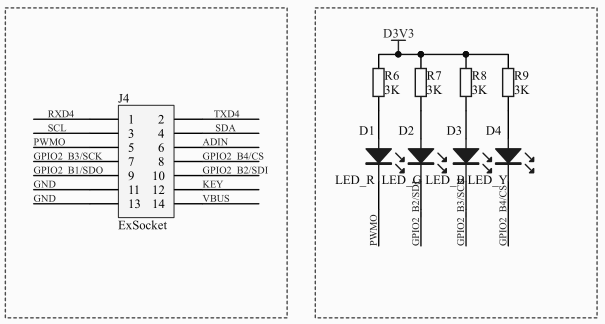

# U-Boot操作GPIO

## 1. GW3399 GPIO简介

### 1.1 GW3399的GPIO划分

&emsp;&emsp;GPIO（General-Purpose Input/Output，通用输入输出）是一种能够被运行时软件进行动态配置和控制的通用I/O引脚。嵌入式开发者通过编程，既可以使GPIO作为输出引脚，以输出高/低电平；也可以使GPIO作为输入引脚，以读取外界输入到嵌入式处理器的信号。

&emsp;&emsp;RK3399共有5组GPIO，分别用GPIO0、GPIO1、GPIO2、GPIO3、GPIO4来表示；而每组GPIO又包含32个IO引脚，分别用A0\~A7、B0\~B7、C0\~C7、D0\~D7表示。

!!!举个栗子
    GPIO0_A1表示RK3399的第1组编号为2的GPIO引脚，而GPIO2_B4则表示第3组编号为12的GPIO引脚。

### 1.2 扩展板LED的GPIO引脚

&emsp;&emsp;由如下所示的电路图可知，ARM扩展板上3的个LED（D4、D3和D2）分别连接到了CPU的GPIO2_B4、GPIO2_B3、GPIO2_B1；并且由于LED的阳极连接到了高电平，因此当GPIO输出低电平时，LED才会被点亮。

<center></center>

!!! 勘误说明
    注意：D2实际连接到CPU的管脚应该是GPIO2_B1，而不是图上标注的GPIO2_B2。

## 2. 在U-Boot中操作GPIO

### 2.1 GPIO的表示

&emsp;&emsp;U-Boot中用A、B、C、D、E表示GW3399的5组IO，用编号0到31表示每组IO中的具体IO口。

!!! 举个栗子
    标号D4的LED在电路图上对应GPIO2_B4，在U-Boot中被表示为“C12”（字符串）

    标号D3的LED在电路图上对应GPIO2_B3，在U-Boot中被表示为“C11”（字符串）

    标号D2的LED在电路图上对应GPIO2_B1，在U-Boot中被表示为“C9”（字符串）

&emsp;&emsp;即：

<center>

| LED灯标号 | 对应的CPU GPIO管脚 | 在U-Boot中的表示方式 |
| :-: | :-: | :-: |
| D4 | GPIO2_B4 | C12 |
| D3 | GPIO2_B3 | C11 |
| D2 | GPIO2_B1 | C9 |

</center>

### 2.2 U-Boot中GPIO操作

``` C++
// 将GPIO名字转换成对应GPIO口程序中的表示方式
int gpio_lookup_name(const char *name, struct udevice **devp,
                        unsigned int *offsetp, unsigned int *gpiop);
    
// 获取GPIO的使用权
int gpio_request(unsigned gpio, const char *label);   

// 释放GPIO的使用权
int gpio_free(unsigned gpio);
```

&emsp;&emsp;以上函数是在drivers/gpio/gpio-uclass.c中定义。

``` C++
// 设置GPIO为输入模式
int gpio_direction_input(unsigned gpio);

// 设置GPIO输出值
int gpio_direction_output(unsigned gpio, int value);

// 获取当前GPIO管脚状态
int gpio_get_value(unsigned gpio);
```

&emsp;&emsp;以上函数是在drivers/gpio/rk_gpio.c中定义。

### 2.3 U-Boot命令定义

&emsp;&emsp;由“U-Boot命令实现及驱动模型”可知，新增U-Boot命令时，需要通过U_BOOT_CMD宏定义（即cmd_tbl_s）来实现：

``` C++
U_BOOT_CMD(name, maxargs, repeatable, command, "usage", "help")
```

&emsp;&emsp;该宏定义有6个主要参数，其含义分别如下表所示。

<center>

| 参数 | 类型 | 释义 |
| :-: | :-: | :-: |
| name | -- | 命令名，非字符串，但在U_BOOT_CMD中用“#”符号转化为字符串 |
| maxargs | 整型 | 命令的最大参数个数 |
| repeatable | 整型 | 是否自动重复（按Enter键是否会重复执行：0-否，1-是） |
| command | void* | 函数指针，指向命令所对应的响应函数 |
| usage | 字符串 | 命令的简短使用说明 |
| help | 字符串 | 命令的较详细的使用说明 |

</center>
