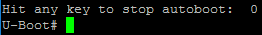

# 实验步骤

&emsp;&emsp;1. 在u-boot/cmd目录下，编写led-test.c；

!!! Tips
    可参考u-boot/cmd/gpio.c来编写led-test.c。

&emsp;&emsp;2. 修改Makefile，并重新编译U-Boot；

&emsp;&emsp;&emsp;在u-boot/cmd/Makefile文件上增加：

``` Makefile
obj-y += led-test.o
```

&emsp;&emsp;&emsp;修改后重新编译，即可将led-test.c编译到uboot.img中。

&emsp;&emsp;3. 将扩展板通过排线连接到GW3399的EXT接口；

&emsp;&emsp;4. 使用下载分立固件的方法，将新生成的uboot.img下载到GW3399；

&emsp;&emsp;5. 使用MobaXterm或其他串口调试工具，连接到GW3399的串口。在固件启动过程中输出“Hit key to stop autoboot('CTRL+C')”时，按下Ctrl+C中断启动过程，从而进入U-Boot命令行，如下图所示：

<center></center>

&emsp;&emsp;6. 在U-Boot命令行中输入下列命令，查看扩展板LED的状态变化。

```shell
> led-test on D4
> led-test toggle D3
> led-test toggle D3
> led-test off D4
> led-test on D2
```
