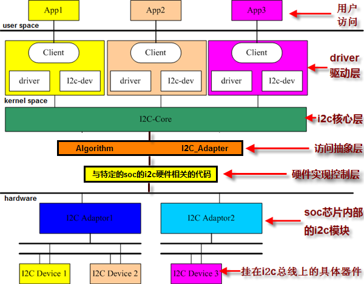

# I2C协议及驱动概述

## 1. I2C协议概述

&emsp;&emsp;I2C总线(Inter-Integrated Circuit Bus) 最早是由Philips半导体（现被NXP收购）开发的一种简单、双向二线制同步串行总线。它只需要两根线（串行数据线SDA和时钟线SCL）即可在连接于总线上的器件之间传送信息。

&emsp;&emsp;要想了解详细I2C协议，可以参考2014年第6版本的I2C标准协议：
[I2C-Bus Standards Specification](https://www.nxp.com/docs/en/user-guide/UM10204.pdf)

&emsp;&emsp;I2C是串行传输总线，按照下面格式进行一位一位传输。协议如下：


## 2. RK3399 I2C接口

&emsp;&emsp;RK3399 CPU提供了有9组I2C总线接口：i2c0 ~ i2c8，需要注意的是，在每一组I2C总线中接入的从设备地址不能有相同。在本次实验中，OLED显示屏和Led8x8点阵都挂到I2C2（I2C Adaptor 2）总线接口上。


&emsp;&emsp;I2C从设备地址（slave address）用7位标识。

- OLED从设备地址

&emsp;&emsp;OLED芯片型号：SSD1316，查该芯片手册可以知道其slave address：

```
b7  b6  b5  b4  b3  b2  b1  b0
0   1   1   1   1   0   SA0 R/W#
```

&emsp;&emsp;其中SA0是由硬件设置为0，最低位b0是读写标志位，因此，SSD1316（OLED）从设备地址是0x78>>1 = 0x3C。

- Led 8x8点阵从设备地址

&emsp;&emsp;Led 8x8点阵芯片型号：ht16k33，查该芯片手册可以知道其slave address：

```
b7  b6  b5  b4  b3  b2  b1  b0
1   1   1   0   0   0   0   R/W#
```

&emsp;&emsp;最低位b0是读写标志位，因此，ht16k33（Led 8x8）从设备地址是0xE0>>1 = 0x70。

## 3.  Linux的I2C驱动框架分析

### 3.1  I2C体系结构

&emsp;&emsp;Linux的I2C体系结构分为3个组成部分（具体分析可以参考陈文智《嵌入式系统原理与设计》、宋宝华《Linux设备驱动开发详解》）：

- **I2C核心**：drivers/i2c/i2c-core.c

&emsp;&emsp;I2C核心提供了I2C总线驱动和设备驱动的注册，注销方法，I2C通信方法(”algorithm”)上层代码实现，探测设备，检测设备地址的上层代码实现。

&emsp;&emsp;一般来说，drivers/i2c/i2c-core.c这个文件不需要被开发人员修改，但是理解其中的函数是非常有必要的。

- **I2C总线驱动**：drivers/i2c/busses/i2c-rk3x.c

&emsp;&emsp;I2C总线驱动是对I2C硬件体系结构中适配器端的实现，适配器可由CPU控制，甚至可以直接集成在CPU内部。

&emsp;&emsp;I2C总线驱动主要包含I2C适配器数据结构i2c_adapter、I2C适配器的Algorithm数据结构i2c_algorithm和控制I2C适配器产生通信信号的函数。经由I2C总线驱动的代码，我们可以控制I2C适配器以主控方式产生开始位、停止位、读写周期，以及以从设备方式被读写、产生ACK等。

&emsp;&emsp;CPU芯片厂商一般都会提供I2C总线驱动代码，放在drivers/i2c/busses目录。如果在这个目录下没有找到相关CPU的驱动代码，还需要驱动人员自行编写。

- **I2C设备驱动**：（**需要实现**）

&emsp;&emsp;I2C设备驱动(也称为客户驱动)是对I2C硬件体系结构中设备端的实现，设备一般挂接在受CPU控制的I2C适配器上，通过I2C适配器与CPU交换数据。

&emsp;&emsp;I2C设备驱动主要包含数据结构i2c_driver和i2c_client，我们需要根据具体设备实现其中的成员函数。

<center></center>

(图片来源于：https://www.jianshu.com/p/d1f30e4279d5)

> **为什么要分为I2C总线驱动程序与I2C设备驱动程序？**
>
> 从硬件层次上来说，I2C的时序是永远不变的（如[I2C-Bus Standards Specification](https://www.nxp.com/docs/en/user-guide/UM10204.pdf)标准已经制定好了），I2C总线驱动程序控制着I2C的时序。而对于I2C设备来说，其设备地址、控制命令、数据都是要根据具体的设备来确定的。比如，实验中提供的OLED和LED 8*8点阵的设备地址和控制命令/数据是不一样的。将总线驱动和设备驱动分开，总线驱动用于决定总线和设备之间如何发数据，而设备驱动决定总线与设备之间发什么数据。一个是怎么发数据，一个是发什么数据，这也体现了Linux内核所倡导的机制与策略分离的编程艺术。
>
> 通过运用面向对象的设计思想，Linux内核将I2C总线适配器抽象出来，用i2c_adapter结构体表示；同时，也将I2C设备的信息抽象出来，用i2c_board_info结构体表示。通过i2c_adapter结构体与i2c_board_info结构体创建出一个i2c_client的结构体，这样，一个i2c_client就可以代表了一个抽象出来软件上可以操作的I2C设备。

### 3.2  I2C驱动几个重要的对象

- **struct bus_type i2c_bus_type** ：I2C总线对应着/sys/bus下的一条总线，这个I2C总线结构体管理着I2C设备与I2C总线驱动的匹配、删除等操作，I2C总线会调用i2c_device_match函数看I2C设备和I2C驱动是否匹配，如果匹配就调用i2c_device_probe函数，进而调用I2C驱动的probe函数。
- **struct i2c_board_info**：描述了I2C设备的硬件信息
- **struct i2c_adapter** ：对应I2C总线适配器
- **struct i2c_client**：对应I2C设备
- **struct i2c_algorithm**：对应如何发送I2C时序
- **struct i2c_driver**：对应I2C设备驱动程序

&emsp;&emsp;小结：

- i2c_driver与i2c_client

&emsp;&emsp;i2c_driver对应一套驱动方法，i2c_client对应真实的物理设备，每个I2C设备都需要一个i2c_client来描述。i2c_driver与i2c_client的关系是一对多，一个i2c_driver可以支持多个同类型的i2c_client。

- i2c_adapter与i2c_client

&emsp;&emsp;i2c_adapter与i2c_client的关系如上述所说，由于一个适配器可以连接多个I2C设备，所以一个i2c_adapter也可以被多个i2c_client依附。

## 4.  OLED设备介绍

### 4.1  OLED硬件介绍

&emsp;&emsp;SSD1316（OLED）像素是96 * 32：


&emsp;&emsp;查SSD1316芯片手册，可以知道：

> There are 3 different memory addressing mode in SSD1316: page addressing mode, horizontal addressing mode and vertical addressing mode.

&emsp;&emsp;本实验选择用Page addressing mode，即分成4个page，PAGE0 ~ PAGE3，每个page有8 Row。


&emsp;&emsp;也就是，可以用二维数组led_buf\[4][96]来完成OLED 96 * 32像素的写操作：

```c++
for (int m = 0; m < 4; m++) {
    ssd1316_write_command(0xb0 + m); /* Set the page start address of the target display location by command B0h to B3h. */
    ssd1316_write_command(0x00); /* Set the lower start column address of pointer by command 00h */
    ssd1316_write_command(0x10); /* Set the upper start column address of pointer by command 10h */
    ssd1316_write_data(led_buf[m]); 
}
```

### 4.2  OLED的读写操作

&emsp;&emsp;Linux内核通过i2c-dev.c提供了一个通用的I2C设备驱动程序，其主设备号都是89，次设备号为0 ~ 255。不过，它实现的是i2c_client是虚拟、临时的，主要是为了便于从用户空间操作I2C外设，实现了字符设备的文件操作接口，对设备的具体访问是通过I2C适配器来实现的。但是，这所有的操作数据都是基于字节流的，没有明确的格式和意义。如上所示，挂载在i2c上的OLED是按buffer块读写，不适合使用字节流来操作OLED。本次实验推荐同学们使用Linux内核提供的设备模型来访问OLED。

&emsp;&emsp;设备模型是为了方便电源管理而设计的一种设备拓扑结构，其开发者为了方便调试，将设备结构树导出为一个文件系统，即sysfs文件系统。sysfs是一个基于RAM的文件系统，它和Kobject一起，可以将Kernel的数据结构导出到用户空间，以文件目录结构的形式，提供对这些数据结构（以及数据结构的属性）的访问支持。请阅读Documentation/filesystems/sysfs.txt 、Documentation/kobject.txt文档以获得更多关于sysfs和kobject 接口的信息。

&emsp;&emsp;为了实现OLED按buffer块读写，推荐同学们使用BIN_ATTR_RW二进制属性文件。

&emsp;&emsp;BIN_ATTR_RW是在include/linux/sysfs.h头文件中的宏定义

```c++
#define BIN_ATTR_RW(_name, _size)       \
struct bin_attribute bin_attr_##_name = __BIN_ATTR_RW(_name, _size)
```

&emsp;&emsp;__BIN_ATTR_RW宏

```c++
#define __BIN_ATTR_RW(_name, _size) __BIN_ATTR(_name,       \
                    (S_IWUSR | S_IRUGO), _name##_read,      \
                    _name##_write, _size)
```

&emsp;&emsp;__BIN_ATTR宏

```c++
/* macros to create static binary attributes easier */
#define __BIN_ATTR(_name, _mode, _read, _write, _size) {    \
    .attr   = { .name = __stringify(_name), .mode = _mode },\
    .read   = _read,        \
    .write  = _write,       \
    .size   = _size,        \
}
```

&emsp;&emsp;把BIN_ATTR_RW(buffer, 4*96)套入以上的宏定义，展开：

```c++
struct bin_attribute bin_attr_buffer(buffer, (S_IWUSR | S_IRUGO), buffer_read, buffer_write, 4*96) {
    .attr = { .buffer   = __stringify(buffer), .mode   = (S_IWUSR | S_IRUGO) },     \
    .read   = buffer_read,      \
    .write  = buffer_write,     \
    .size   = 4*96,             \
}
```

&emsp;&emsp;当应用层对“/sys/bus/i2c/devices/i2c-2/2-003c/buffer”文件进行read、write等操作时，进而会调用到buffer_read、buffer_write函数。其中i2c-2是OLED挂载到RK3399的i2c2总线上，2-003c代表i2c2总线，从设备地址为0x3c。

```c++
ssize_t buffer_read(struct file *f, struct kobject *k, struct bin_attribute *a, char *buf, loff_t of, size_t len)
   
    //注：该函数可以直接将led_buf[4][96]拷贝给buf，即只需要读取设备驱动中的缓存。
```

```c++
ssize_t buffer_write(struct file *f, struct kobject *k, struct bin_attribute *a, char *buf, loff_t of, size_t len)
```

## 5. SSD1316的裸机驱动代码

&emsp;&emsp;由芯片手册可知，SSD1316的厂商已提供OLED的初始化配置、写命令和写数据流程，同学们需要参考厂商提供的驱动代码（针对无操作系统）来编写OLED的Linux I2C设备驱动程序。

- OLED初始化：在I2C设备驱动程序probe执行时，需要对OLED初始化。
- OLED写命令/写数据：请参照以下代码实现：

``` C++
// Internal setting（Charge pump）
void sh1316()
{
    RES = 0;
    delay(1000);
    RES = 1;
    delay(1000);
    
    /* 初始化配置 */ 
    write_i(0xAE); /*display off*/
    write_i(0x00); /*set lower column address*/
    write_i(0x10); /*set higher column address*/
    write_i(0x40); /*set display start line*/
    write_i(0xb0); /*set page address*/
    write_i(0x81); /*contract control*/
    write_i(0x60); /*128*/
    write_i(0xA1); /*set segment remap*/
    write_i(0xA6); /*normal / reverse*/
    write_i(0xA8); /*multiplex ratio*/
    write_i(0x1F); /*duty = 1/32*/
    write_i(0xC0); /*Com scan direction*/
    write_i(0xD3); /*set display offset*/
    write_i(0x00);
    write_i(0xD5); /*set osc division*/
    write_i(0x80);
    write_i(0xD9); /*set pre-charge period*/
    write_i(0x22);
    write_i(0xDA); /*set COM pins*/
    write_i(0x12);
    write_i(0xdb); /*set vcomh*/
    write_i(0x40);
    write_i(0x8d); /*set charge pump enable*/
    write_i(0x15); /* 0X15，7.5V； 0X14，9V */
    write_i(0xAF); /*display ON*/
}

// 写时序
void write_w(unsigned char dat)
{
    unsigned char m,da;
    unsigned char j;
    da = dat;
    for (j = 0; j < 8; j++){
        m = da;
        SCL = 0;
        m = m & 0x80;
        if (m == 0x80)
            SDA=1;
        else
            SDA = 0;
        da = da << 1;
        SCL = 1;
    }
    SCL = 0;
    SCL = 1;
}

void write_i(unsigned char ins)
{
    // 起始位
    start();
    
    /* 写命令 */
    write_w(0x78);
    write_w(0x00);
    write_w(ins);
    
    // 停止位
    stop();
}

void write_d(unsigned char dat)
{
    // 起始位
    start();
    
    /* 写数据 */
    write_w(0x78);
    write_w(0x40);
    write_w(dat);
    
    // 停止位
    stop();
}

void start()
{
    SCL = 1;
    SDA = 1;
    SDA = 0;
    SCL = 0;
}

void stop()
{
    SCL = 0;
    SDA = 0;
    SDA = 1;
    SCL = 1;
}

void delay(unsigned int t)
{
    while (t > 0) t--;
}
```
